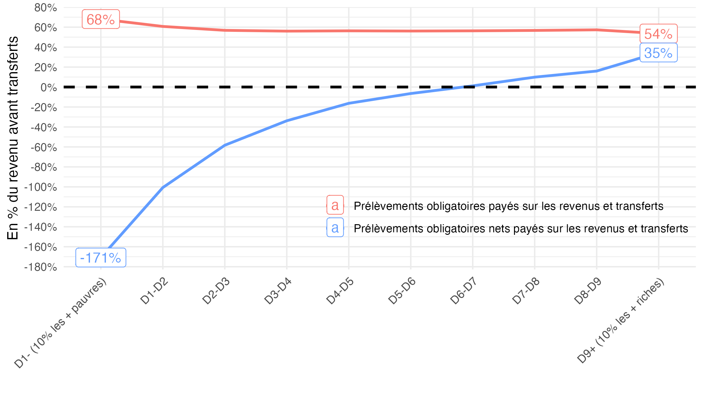

# Quelques données sur la redistribution en France

## Figure 1 : Prélèvements (bleu) et prélèvements nets des transferts (rouge) payés sur les revenus et les transferts (En % du revenu avant transferts)

[Code R](figure1.R)

